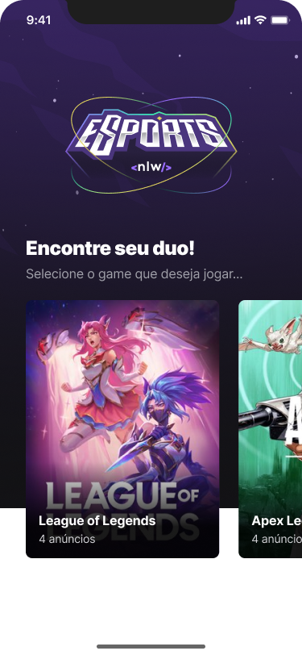
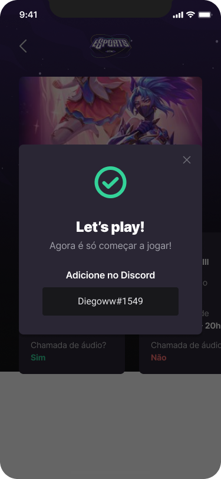

# eSports - Mobile 

<p align="center">
  <a href="#-telas-da-aplicação">Telas</a>&nbsp;&nbsp;&nbsp;|&nbsp;&nbsp;&nbsp;
  <a href="#-informações-do-projeto">Informações</a>&nbsp;&nbsp;&nbsp;|&nbsp;&nbsp;&nbsp;
  <a href="#-tecnologias-e-ferramentas-usadas">Tecnologias</a>&nbsp;&nbsp;&nbsp;|&nbsp;&nbsp;&nbsp;
  <a href="#-clonando-o-projeto-para-sua-máquina">Clonar</a>&nbsp;&nbsp;&nbsp;
  |&nbsp;&nbsp;&nbsp;
  <a href="#-como-executar-o-projeto-em-seu-celular-ou-emulador-usando-o-expo">Executando</a>&nbsp;&nbsp;&nbsp;|&nbsp;&nbsp;&nbsp;
  <a href="#-dúvidas">Dúvidas</a>&nbsp;&nbsp;&nbsp;|&nbsp;&nbsp;&nbsp;
  <a href="#-licença-mit">Licença</a>
</p>

---
<br/>
<br>
<br>

# 📱 Telas da aplicação

> <p>

</p>

<br>
<br>

# 👽 Informações do projeto

- Você pode acessar o layout do [**projeto no Figma** aqui](https://www.figma.com/file/a1THQc0A7wM3f9rJ9x21ip/NLW-eSports-(Community)?node-id=0%3A1&t=TYjlRcdDLRlIkKgC-0).
- Você pode acessar a versão web aqui [**projeto no github** aqui](https://github.com/marlisonmourao/web-eSports).
- Você pode acessar a API usada no projeto aqui [**projeto no github** aqui](https://github.com/marlisonmourao/server-eSports).

<br>
<br>

# 🏇 Tecnologias e ferramentas usadas

- [React Native](https://reactnative.dev/)
- [Expo](https://expo.dev/)
- [TypeScript](https://www.typescriptlang.org/)
- [Google Fontes](https://fonts.google.com/)
- [expo Notifications](https://docs.expo.dev/versions/latest/sdk/notifications/)
- [Expo clipboard](https://docs.expo.dev/versions/latest/sdk/clipboard/)

<br>
<br>

# 💻 Clonando o projeto para sua máquina

1. Abra o terminal de seu computador.
2. Acessar a pasta de seus projetos.
3. Estando dentro da pasta de seus projetos, execute os comandos abaixo para clonar o projeto online:

```bash
# Para fazer o download do projeto para seu computador
$ git@github.com:marlisonmourao/mobile-eSports.git

# Entrar na pasta do projeto 
$ cd mobile-eSports

# Para baixar as dependências do projeto
$ npm install

# Abra com o editor vscode
$ code .
```

4. Pronto, agora basta testar e fazer as alterações que desejar.
  
<br>
<br>

# 🔥 Como executar o projeto em seu celular ou emulador usando o expo

<!-- 1. Dentro da pasta da aplicação pelo terminal, execute o comando abaixo -->

1. Em seguida, abra uma nova janela do terminal e execute o comando abaixo:

```bash
# Este comando disponibilizar o projeto para ser aberto pelo aplicativo expo Go que você deve ter instalado em seu dispositivo físico ou no emulador. 

$ npx expo start

```

2. Em seguida, com o aplicativo **Expo Go** instalado em seu smartphone, basta ler o QRCode que aparece na tela do computador.

<br>

<br>

## 📄 Licença MIT

- Consulte a [LICENÇA](LICENSE) para mais informações.
<br>
<br>

<p align="center"></p>
<br>
<br>

---
<p align="center"> Made with 💜 by <a href="https://github.com/marlisonmourao"> Marlison Mourão </a></p>